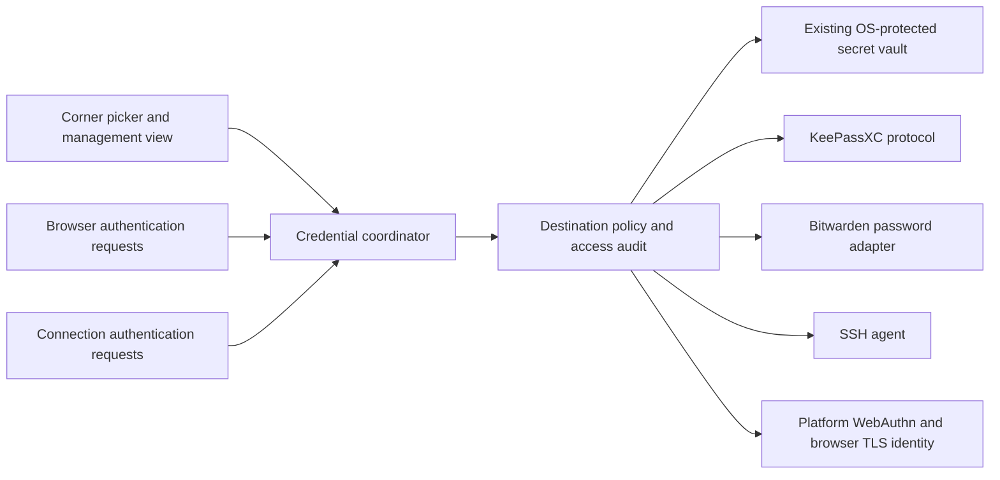

# Credential sources and authentication widget

Status: proposed for discussion. Research date: 2026-09-17. Repository baseline: `17c56b67`. Design task: `asura-911`. Qualification follow-up: `asura-912`. Implementation follow-up: `asura-913`.

This proposal specifies the product and integration boundaries. It does not claim that the integrations have been implemented or qualified. Source inspection and vendor documentation establish the available routes; the acceptance experiments below establish whether those routes work in Asura's shipped runtime.

## Recommendation

Add a Credentials button to the workspace corner controls. It opens a contextual picker for the active browser or connection, with access to a larger management view. Connect it to operation-specific credential sources: Asura's existing OS-protected secrets, KeePassXC, Bitwarden, SSH agents, platform passkey providers, and browser-visible certificate identities.

Passkey private keys and certificate private keys remain with their providers. Asura requests registration, authentication, or certificate selection. It never imports those private keys into `ISecretVault`, implements their synchronization, or adds its own software authenticator. Public certificate information may be displayed without changing private-key custody.

Use KeePassXC as the first external integration to prove contextual login discovery and the multi-source design. Offer Bitwarden CLI as an advanced connector for explicitly linked items, with its separate unlock experience explained at setup. Full Bitwarden discovery needs a supported, qualified interface that does not export unrelated private-key material. Qualify passkeys separately because available provider operations do not solve the browser integration boundary by themselves. Select client certificates from the browser's platform-backed candidates.

The shared UI does not imply universal CRUD, a complete inventory of every passkey, or support for every credential type in every source.

## Findings that constrain the design

### Existing Asura boundaries

| Area | Current evidence | Design consequence |
| --- | --- | --- |
| Secret storage | `src/Asura.Application/ISecretVault.cs`; `src/Asura.Infrastructure/PlatformSecretVaultFactory.cs` | Reuse local storage, opaque references, authorization and auditing. Do not replace all consumers. |
| Scope authorization | `src/Asura.Application/SecretScopeAccessPolicy.cs` | Ownership scope currently matches purpose target. External source ownership and permitted destinations need separate checks. |
| Management UI | `src/Asura.App/ViewModels/SecretSettingsViewModel.cs` | Retain local mutation and dependency checking. Ordinary management deliberately cannot resolve secret values. |
| Browser | `vendor/exclr8cef/cef.json`; `native/shim/exclr8cef_osr.cc` under the vendor directory | CEF 150.0.9, Chromium 150.0.7871.46; the OSR shim explicitly selects Alloy style. |
| Browser input | `src/Asura.Browser/CefBrowserSemanticAdapter.cs`; `src/Asura.Application/BrowserElementFillRequest.cs` | Existing fill transports text. Add a separate credential-use request; do not put passwords into ordinary agent fill arguments. |
| Browser evaluation | `src/Asura.Agent.Runtime/BrowserAgentToolSet.cs`; `src/Asura.Application/BrowserAutomationModels.cs` | Evaluation has policy, textual and result restrictions; these do not establish non-disclosure for a newly filled document. Authentication needs an explicit observation boundary. |
| SSH | `src/Asura.Files/SystemSshAgentIdentitySource.cs`; `src/Asura.Infrastructure/ConnectionCredentialBroker.cs` | Reuse agent signatures and existing execution-boundary credential delivery. |
| Workspace isolation | `src/Asura.Desktop/IsolatedBrowserRendererViewFactory.cs`; issue `asura-s5f` | Host-rendered browser traffic and guest processes are different cases. Never mount host vaults or forward a full host agent implicitly. |
| Internal security keys | `src/Asura.Desktop/DesktopComposition.cs`; issue `asura-e1r` | Separate internal security material before broadening user credential discovery. |
| Corner controls | `src/Asura.App/Views/WorkspaceView.axaml` | Extend the existing flyout pattern and spacing rather than add a new toolbar. |

Older browser ADRs describe earlier engines and staged capabilities. Implementation claims in this proposal follow the current source; ADRs provide historical rationale.

### Verified backend routes

| Source | Passwords and codes | Passkeys | SSH | Client certificates |
| --- | --- | --- | --- | --- |
| Asura local credentials | Existing byte-secret storage; add structured login records and matching | No Asura-owned storage | Existing stored-key paths remain compatible | No new private-key storage |
| Apple platform | Existing Asura Keychain namespace; broader Apple Passwords integration is a separate platform qualification | Browser AuthenticationServices APIs, entitlement and authorization required | Use configured agent | Keychain identity used through browser/platform TLS |
| Windows platform | Existing DPAPI-protected Asura storage | Native WebAuthn APIs; installed provider support is version-dependent | Named-pipe/agent implementation must be qualified | Browser-visible Windows certificate identities |
| Linux platform | Secret Service for byte secrets | Secret Service is not a WebAuthn API; qualify browser/device paths separately | Unix agent socket | Browser-visible certificate/token store; distribution-specific qualification |
| KeePassXC | Paired browser protocol for URL matches, login writes and TOTP | Explicit registration/assertion protocol | KeePassXC can load keys into an existing SSH agent | No delegated TLS signing interface established by this investigation |
| Bitwarden | Field-specific CLI retrieval for explicit bindings; automatic discovery needs a separately qualified interface | Extension/mobile support is established; Asura route is conditional | Desktop SSH agent | No delegated TLS signing interface established by this investigation |

These are integration routes, not a support announcement. Runtime capability detection and release qualification determine what the picker enables.

Bitwarden distinguishes its organizational Public API from the local Vault Management API. Neither should be confused with the separate Secrets Manager product. Use the Password Manager tooling for users' logins. [Bitwarden APIs](https://bitwarden.com/help/bitwarden-apis/).

The CLI has its own login/unlock state. API-key login does not substitute for decrypting the vault. `bw serve` starts a local HTTP service and preserves origin protection by default. This design prefers short-lived CLI processes over a persistent HTTP listener, subject to the secret-input experiment below. [CLI documentation](https://bitwarden.com/help/cli/).

Source inspection found a further constraint: CLI `CipherResponse` uses `LoginResponse`, which inherits `LoginExport`; that export includes FIDO2 records with a `keyValue` field. Treat whole-item output as potentially containing passkey private material. Do not use `bw list items`, `bw get item`, vault exports or equivalent whole-item API responses for picker discovery, even if Asura would later discard those fields. Use field-specific getters with exact user-linked item IDs, not ambiguous names, and qualify their actual output. The vendor CLI may decrypt its own vault internally; Asura must not receive the unwanted key fields. A small Asura-authored JSON filter after extraction would not meet this boundary. [CLI response](https://github.com/bitwarden/clients/blob/be364be6b4b1f0f179ae44f8a35103a65e1fc556/apps/cli/src/models/response/login.response.ts), [login export](https://github.com/bitwarden/clients/blob/be364be6b4b1f0f179ae44f8a35103a65e1fc556/libs/common/src/models/export/login.export.ts), [FIDO2 export](https://github.com/bitwarden/clients/blob/be364be6b4b1f0f179ae44f8a35103a65e1fc556/libs/common/src/models/export/fido2-credential.export.ts).

KeePassXC's protocol exposes association, URL-scoped login retrieval, TOTP, login writes, and passkey registration/assertion. Login results can already contain passwords, so a metadata-only UI does not imply metadata-only backend access. The adapter must bound and dispose those responses. KeePassXC is the initial target; generic KeePass plugins and direct KDBX editing are separate integrations. [Protocol](https://github.com/keepassxreboot/keepassxc-browser/blob/develop/keepassxc-protocol.md).

Bitwarden's browser extension replaces the WebAuthn JavaScript entry points and can fall back to the browser's native implementation. Its existence does not establish an external signing API for Asura. [Extension architecture](https://contributing.bitwarden.com/architecture/deep-dives/passkeys/implementations/provider/browser-extension/).

There is also a Bitwarden desktop IPC integration for DuckDuckGo. Its documented test commands cover account status, login retrieval/writes and generation. It is an investigation candidate, not a declared generic desktop API or passkey route. Asura must identify itself honestly and must not bypass application verification. [Native messaging documentation](https://contributing.bitwarden.com/getting-started/clients/desktop/native-messaging-test-runner/), [command dispatcher](https://github.com/bitwarden/clients/blob/be364be6b4b1f0f179ae44f8a35103a65e1fc556/apps/desktop/src/services/encrypted-message-handler.service.ts).

Bitwarden's current source contains Windows plugin-authenticator registration code. That establishes implementation work, not availability in every installed release. Microsoft documents plugin passkey managers starting with Windows 11 24H2. Enable this route only after checking both OS and installed provider. [Bitwarden registration](https://github.com/bitwarden/clients/blob/be364be6b4b1f0f179ae44f8a35103a65e1fc556/apps/desktop/desktop_native/napi/src/passkey_authenticator_internal/windows.rs), [Windows WebAuthn](https://learn.microsoft.com/en-us/windows/security/identity-protection/hello-for-business/webauthn-apis).

Apple supports browser passkey selection using metadata and authentication through `ASAuthorizationController`; key data is not returned to the browser's picker. The browser entitlement requires Apple's approval, so eligibility is an external dependency. [Browser passkey integration](https://developer.apple.com/documentation/authenticationservices/authenticating-people-by-using-passkeys-in-browser-apps), [entitlement](https://developer.apple.com/documentation/bundleresources/entitlements/com.apple.developer.web-browser.public-key-credential).

CEF's upstream Alloy extension-support request was closed as not planned. Combined with Asura's explicit Alloy OSR mode, this rules out assuming that installing the Bitwarden Chrome extension solves the feature. It does not prove that every native WebAuthn route fails. [CEF issue 3859](https://github.com/chromiumembedded/cef/issues/3859).

CEF provides `OnSelectClientCertificate`, including server/proxy identity and candidate certificates. Its implementation acquires the selected identity's private-key interface and continues TLS. The application callback is a selection API, not an arbitrary external sign-bytes API. [CEF request handler](https://github.com/chromiumembedded/cef/blob/89af13ad79ee43c13718153338ba1353aacc6157/include/cef_request_handler.h), [implementation](https://github.com/chromiumembedded/cef/blob/89af13ad79ee43c13718153338ba1353aacc6157/libcef/browser/chrome/chrome_content_browser_client_cef.cc).

## Product behavior

### Corner picker

Use a key icon with the accessible name “Credentials”. A shortcut and command-palette action open the same picker. The button remains available even with no configured source. A small activity indicator means an authentication request is waiting; it does not disclose the number of saved accounts while locked.

The initial view captures the active panel and shows its destination. Opening the picker must not lose the browser input target. Subsequent panel switches or navigation invalidate that target; the picker updates and requires a fresh selection rather than silently delivering to the new destination.

```text
Credentials                                      [×]
For https://github.com · Work browser
[ Search accounts…                                 ]
Sources: All

Work account
alex@company.com · KeePassXC                  [Fill]

Personal account
alex@example.com · Bitwarden          [Unlock & fill]

[Save login]       [All credentials]       [Sources]
```

This is a behavioral wireframe, not a final visual mockup. Match the existing shell controls, use a compact scrollable list, preserve keyboard focus, support Escape, and announce busy/error states without speaking secret values. No hover action reveals or copies a secret.

The picker lists exact destination bindings first, then safe provider matches. It never merges entries solely because names or usernames match. Source and account are always visible. Search initially filters already-retrieved results; it must not send every keystroke or a global vault query to every backend.

For the initial Bitwarden CLI connector, results are limited to explicitly linked entries. Setup asks the user to choose/copy an item identifier in Bitwarden and associate an exact destination in Asura. The connector retrieves only the selected fields after authorization. Label it as limited integration, not full vault search. Prefer a supported desktop/provider integration for the eventual seamless experience; generic access to the DuckDuckGo interface still needs qualification and upstream support confirmation.

For SSH, show username, endpoint and key fingerprint with “Use for this connection”. For a TLS request, show the requesting host, whether it is a proxy, certificate subject, issuer, expiry and fingerprint. For passkeys, show the requesting site and available providers; a provider may own account selection and present its own dialog.

Opening the picker is not permission to unlock every source. Locked sources show “Unlock…”, disconnected sources show “Connect…”, and contextual-only sources show that browsing all entries is unavailable. No configuration produces “Add a source” and an explanation that Asura's local OS-protected storage is available for ordinary secrets.

### Management view and ownership

The larger Credentials view has Items, Sources and Usage views. Items show only entries that a source can enumerate, plus explicitly linked entries. Passkey metadata stays scoped to the requesting site when the platform requires that. There is no promise to display every passkey stored on the device.

Local credentials support creation, replacement, relabeling and deletion using existing dependency checks. For external entries, the initial default is “Manage in provider”. In-app login creation/update is enabled only for a tested write capability. “Add passkey” navigates to the website's registration flow; it does not manufacture a standalone key.

Separate “Remove link from Asura”, “Disconnect source”, and “Delete in provider”. Disconnecting a source reports affected connections and disables their bindings without deleting provider data. Global provider locking and certificate import/renewal occur in the provider's UI. Do not offer controls for unsupported capabilities.

Save-login begins as an explicit user action. Show the detected username, exact site and destination vault; mask the password. Use only the selected form, never capture arbitrary keystrokes. Navigation or closing discards the unsaved draft. Later save suggestions may watch a qualified form submission, but failed-login detection must not automatically overwrite an existing entry.

TOTP is an explicit action separate from password fill. Keep the seed with the provider when it can generate codes. A code is sensitive, expires quickly and cannot be replayed after an uncertain fill. Password generation belongs to the selected backend when supported; local generation must use the existing approved cryptographic boundary and must not record generation history in diagnostics.

“Copy password” and “Reveal” are separate, deliberate operations for supported ordinary secrets. They require a new user-management use purpose; current generic `UserManagement` must continue to deny resolution. Clipboard clearing is best effort and only clears the value Asura placed there if it remains unchanged. No clipboard path for passkeys or certificate private keys.

## Application model and ownership

Keep `ISecretVault` as the existing local byte-secret contract. Do not add signing, native dialogs, WebAuthn or provider account switching to it. Introduce a small application-owned credential coordinator that routes concrete use cases through available adapters. Interface names remain provisional until two real adapters validate the signatures.



### Persistent records

| Record | Contents | Storage and authority |
| --- | --- | --- |
| Credential source | Local ID, provider kind, account/database identity, display name, selected executable/socket or server, enabled state | Local encrypted application configuration; no passwords or session keys |
| Provider reference | Source ID plus provider-owned stable item identifier | Protected local binding data; never log it as harmless text |
| Credential binding | Provider reference, workspace/profile or connection target, exact allowed destination, allowed operation, revision | Asura policy; a link grants no authority by itself |
| Local login | Label, username, authorized origins and references to password/optional code material | Sensitive metadata in encrypted application storage, secret material in existing OS-protected vault |
| Pairing material | KeePassXC association keys or supported integration credentials | Dedicated OS-protected integration namespace, excluded from user Items |
| Capability/availability snapshot | Supported operations, contextual/global discovery, locking behavior, provider version, typed failure | Runtime state; rechecked before use |
| Usage audit | Action, closed outcome, provider kind and existing pseudonymized linkage | Existing audit mechanism; no credential payloads, challenge bytes or usernames |

An application binding must not embed a key-store native pointer or rely on an unstable OS object path. A provider owns resolution of its stable identifiers. Public fingerprints help users distinguish identities, but do not authorize an operation.

Local login ownership needs a dedicated credential scope and narrowly named use purposes. The coordinator first authorizes the destination binding, then resolves the local credential under its owner scope. Existing connection/provider scopes keep their present meaning. Do not broaden `Global` or `PlatformMaintenance` to make cross-source access work.

Existing definitions using `SecretRef` continue to resolve unchanged. Add an explicit alternative reference for an external binding where needed; do not encode backend names or URLs into old `SecretRef` strings. Migrate consumers incrementally. Exports omit integration keys and live sessions; imported external bindings are unresolved until the user maps an appropriate source. Never silently copy external secrets into local storage when a backend becomes unavailable.

Capabilities are operations, not a single read/write flag: contextual login discovery, global discovery, login fill, login write, code generation, reveal/copy, SSH identity use, WebAuthn create/get, TLS client-identity selection, and opening provider management. Effective capability is the intersection of provider support, installed version/platform, browser integration, target policy and current source state.

An adapter can require provider-owned selection without returning entries. That is a first-class outcome, not an empty search result. Avoid a general `Execute(string, JSON)` interface or a plugin framework. Use typed requests for the operations actually implemented.

## Authentication flows

### Browser login and HTTP authentication

1. Capture browser session, profile, workspace, top-level origin, target frame origin, committed document revision and exact field/form handles from trusted browser state.
2. Discover matching credentials only from enabled sources allowed in that workspace. Suggestions do not authorize filling. Default to exact HTTPS origins, including port. Explicit additional origins can be saved; no implicit parent-domain or substring match.
3. The user selects an account and an operation. Unlock only that source if necessary. Revalidate all target bindings after the unlock dialog returns.
4. Acquire a short-lived material lease inside the adapter/coordinator boundary. Keep passwords out of view models, agent arguments, generic evaluation requests, exception text and audit records.
5. Deliver through a dedicated browser credential-fill operation to the revalidated fields. Initially allow main-frame login forms. Cross-origin iframe login requires a separate reviewed flow identifying both origins. Inspect form action as an additional signal, while recognizing that page script can transmit the value elsewhere.
6. Return only a typed completion receipt. Do not echo or read back the password into application logs. Clear the material lease. Leave submission to the user initially.

Browser-engine calls necessarily transfer a password to the receiving renderer and page. No design can make a password invisible to the website receiving it. Avoid promising complete in-memory erasure in managed code; minimize copies and their lifetime.

Support split username/password pages by repeating discovery and authorization at each document. Do not automatically follow redirects with a credential. HTTP Basic/Digest challenges use the browser callback with exact host, port, realm and server/proxy role, not form injection. HTTPS proxy credentials remain associated with the configured proxy; website credentials cannot satisfy proxy challenges.

Page content, URL labels and origin strings supplied by JavaScript are untrusted. Native browser session/frame identity is authoritative. Deny opaque/sandboxed origins, insecure destinations and stale documents by default; any later local-development exception needs a separate explicit policy and tests.

### Passkey registration and authentication

Two independent adapters are required: the browser request adapter and the authenticator provider. “KeePassXC supports passkeys” proves only the provider half.

Prefer the engine's native WebAuthn route for platform authenticators, hardware security keys and supported phone flows. It preserves browser validation and existing provider UI. Asura may display a waiting state while the platform owns the chooser. Use Apple/Windows browser APIs only through a qualified request adapter that supplies the website request and native window correctly.

For a directly connected provider such as KeePassXC, the desired request boundary carries a trusted document/frame binding, create/get operation, challenge, relying-party ID, user-verification requirement, credential constraints, timeout and supported extensions. The browser side validates the caller, secure context, RP ID and permissions before provider dispatch. RP IDs are not interchangeable with full password origins. Do not reimplement a partial WebAuthn client and silently relax requirements. [WebAuthn specification](https://www.w3.org/TR/webauthn-3/).

The current Asura shim has no established general WebAuthn request callback. The first experiment must decide whether a maintainable native integration is available. If direct-provider routing needs a document-start WebAuthn bridge, it requires its own reviewed design: a fixed narrow create/get API, authenticated renderer IPC carrying native frame identity, browser-owned origin and document lifetime checks, correct results/errors/abort behavior, and conformance tests. A JavaScript-supplied `origin`, a public local HTTP signing endpoint, or unrestricted native RPC is unacceptable. An injected polyfill is not declared equivalent to native browser WebAuthn merely because one site accepts it.

Initial custom routing may support explicit main-frame create/get only. Conditional mediation, embedded frames, related-origin requests and extensions such as PRF are separate negotiated capabilities. Unsupported required behavior must fail or use a user-selected native route; it must not be stripped. Device discovery remains silent until the website/user interaction permits prompting. Registration can leave a provider entry behind if the website fails afterward; report the outcome without attempting destructive rollback.

All responses stay bound to the original request and document. Navigation, abort, source lock, profile switch or renderer loss invalidates the pending operation. Provider cancellation settles the request once. Never race multiple authenticators or automatically retry registration after an ambiguous response.

Bitwarden passkeys remain conditional until an installed system-provider route or an upstream-supported browser integration passes this gate. Do not extract passkey private keys via a vault API or use test-only CDP virtual authenticators as a production workaround. An external-browser fallback is a user-visible navigation choice; it cannot promise to authenticate the embedded browser or import its cookies.

### SSH identities

Use the existing agent protocol for identity listing and signatures. Bind a selected public key fingerprint to a connection and a configured agent endpoint. Do not try all identities in the user's agent. Preserve existing host-key verification; a username and hostname alone do not prove the remote server identity.

Bitwarden provides its own agent. KeePassXC's integration adds keys to an existing agent rather than establishing that every key is an independently enumerable vault entry in Asura. The picker should name the actual agent as the signing source unless stronger provenance is available. [Bitwarden agent](https://bitwarden.com/help/ssh-agent/), [KeePassXC agent integration](https://github.com/keepassxreboot/keepassxc/blob/5ac1b0c98d4fafb958490d7d78f7e78533d18cc8/docs/topics/SSHAgent.adoc).

Agent-backed SSH in an isolated workspace depends on `asura-s5f`. An identity filter alone cannot guarantee destination restriction for arbitrary sign requests. Either use an end-to-end qualified destination-bound protocol or have a trusted broker construct the connection authentication. Do not expose the unrestricted host socket to a guest. [OpenSSH agent restriction design](https://www.openssh.org/agent-restrict.html).

### Client certificates

Treat certificates as identities selected for a pending TLS request. Add the missing Asura/vendor-shim event and asynchronous continuation for CEF's candidate selection callback. Retain native candidates only for the request lifetime and show safe metadata in the picker. Complete or cancel the callback exactly once on the correct thread.

Choose from the browser-provided candidates. The TLS stack obtains the private-key operation through the platform identity, including a supported token provider. Asura does not read a PKCS#12 attachment, unpack its private key, write a temporary PEM file or install a certificate automatically. Certificate-only files do not supply an authentication identity. Apple's `SecIdentity` is explicitly the certificate/private-key pairing. [Apple identities](https://developer.apple.com/documentation/security/storing-an-identity-in-the-keychain).

Remembering a choice is optional and scoped to browser profile, endpoint, proxy/server role and certificate fingerprint. Revalidate it against each new candidate set and expiry. Revoking a selection affects future authentication; existing TLS connections or authenticated sessions may remain active until closed. Changing or locking the binding must clear relevant browser selection caches or retire its request context if no narrower API is available.

Server certificate validation remains a separate concern. Picking a client identity never accepts an invalid server certificate. Browser mTLS qualification does not imply that database, VPN or arbitrary HTTP consumers can use the same identity; each transport needs its own non-exporting platform integration.

## Source sessions and lifecycle

Model availability as disconnected, locked, ready or unavailable with a typed reason. Busy is per operation, not a global source state. Source generation changes invalidate outstanding handles whenever the account/database, endpoint, permissions or unlock session changes.

Source setup runs on the host. Pair KeePassXC using the documented encrypted protocol and store association material in the integration namespace. Bind to the paired database identity; opening another database must not silently switch sources. Use an audited cryptographic dependency, never hand-written protocol cryptography.

For Bitwarden CLI, select a trusted executable and isolated app-data directory per source/account. Keep sessions independent of the user's shell. Secret values must not appear in argv, inherited logs or temporary plaintext files. If the CLI only accepts an ephemeral session via a child environment, review that as a narrow boundary exception; the current vault contract forbids material in process arguments. Prove safe input/output and cancellation with the actual pinned CLI before enabling it. Do not persist the master password or live session key, or assume that unlocking the desktop app unlocks the CLI.

Prefer provider-owned unlock UI when a supported integration offers it. Asura can host a masked unlock field for the CLI only after that adapter passes its boundary review. No startup unlock prompts, background vault-wide prefetch or generic filesystem discovery of password databases.

Locking Asura cancels pending requests, drops material leases and local sessions, clears sensitive UI and revokes guest bridges. It does not claim to lock another application globally. Closing the picker cancels its pending interactive operation; a platform dialog cannot complete against a stale target afterward. A provider disconnected during use does not cause fallback to another account.

Proposed defaults: 60-second pending picker/material lifetime, at most one interactive authentication per browser session, 5-minute idle lifetime for an Asura-owned CLI unlock session, and immediate invalidation on app lock or OS session lock. Browser/provider timeouts may be shorter. These values are UX defaults to validate, not cryptographic guarantees or overrides of provider policy.

Read-only discovery can be retried after a transient failure. Fill, login writes, assertions and registrations cannot be replayed automatically after dispatch might have occurred. Return distinct `Cancelled`, `Locked`, `Unavailable`, `NotSupported`, `StaleTarget`, `Denied`, `ItemMissing`, `Failed` and `OutcomeUnknown` results. Map provider errors to safe messages; keep raw payloads out of telemetry.

## Agent, privacy and isolation boundaries

The agent receives neither vault enumeration nor a generic resolve-secret tool. A governed “use credential” action refers to an opaque user-authorized choice and exact target, with a receipt as its result. “Browser interaction allowed” does not grant credential-use permission. Raw reveal/copy and changing allowed destinations remain user operations.

Mark authentication documents as sensitive before delivery. Suspend agent evaluation, DOM/value extraction, screenshots and other browser observations that could expose values for that document, and redact password/code fields from ordinary snapshots. A new trusted document transition can end the interval; SPA completion needs a qualified refresh/transition or explicit continuation flow. An arbitrary provider-supplied “login succeeded” label cannot clear the restriction. This extends the existing browser governance boundary and needs acceptance tests for every observation tool, including MCP.

Field masking alone is insufficient because page script can copy a password elsewhere. A malicious authorized website, compromised renderer/host, OS accessibility access outside Asura, or a user revealing a secret is outside the guarantee that the credential broker keeps values out of model/tool payloads. Asura does not provide a general defense against arbitrary same-user malware. Backend consent and protected IPC still limit accidental exposure and unauthorized app paths.

Do not put credential names, account names, origins, raw references or protocol transcripts in general telemetry. Search indexes and cached display metadata are sensitive. Use encrypted application storage when persistence is needed and clear runtime caches on lock. Linux Secret Service lookup attributes may be unencrypted, so they should carry opaque identifiers rather than account descriptions. [Secret Service specification](https://specifications.freedesktop.org/secret-service/latest-single/).

Keep provider processes, sockets and vault paths on the host. A host-rendered browser using a workspace network proxy can use the host coordinator with a workspace-bound authorization. A guest process requires a separate authenticated, short-lived operation lease. Passkey and certificate-key bytes never cross that boundary. Existing connection secrets may still need delivery to an approved consumer under their established broker policy.

Before exposing a broad Items view, resolve `asura-e1r`: internal encryption keys and startup-protection material need a distinct native-vault namespace and a recoverable migration. Hiding them only in the new UI is insufficient. Integration pairing/session machinery must also be excluded from ordinary listing, deletion and export.

## Decisions and alternatives

The following are recommendations within this design, not authorization to implement unrelated refactoring.

- **S1, recommended:** Keep provider custody. Around `ISecretVault.ResolveAsync`, remove the need for a passkey/key-import layer and cross-vault synchronization.
- **S2:** Reuse `SystemSshAgentIdentitySource.ReadAsync` for signatures and identity selection; avoid per-vault SSH private-key extraction.
- **S3:** Keep `SecretSettingsViewModel` responsible for local mutation and delegate unsupported external editing; avoid a universal CRUD interface and duplicated provider policy.
- **S4:** Build the corner picker in the existing workspace control group; avoid a separate persistent credential toolbar or duplicate management window.

Direct KDBX editing would move database unlocking, writes and conflict recovery into Asura; postpone it. A full custom Bitwarden client would add vault cryptography, sync and account-lifecycle ownership; postpone it. Generic browser-extension hosting would change the browser architecture and security budget; it is not a prerequisite for login filling. A custom WebAuthn authenticator contradicts the user's custody requirement. A single giant vault interface would obscure the difference between byte retrieval and authentication operations.

## Delivery and qualification

The product design is complete enough to split implementation, but these experiments are release dependencies. Failure has a defined outcome rather than a weaker fallback.

| Gate | Experiment and evidence | Decision on failure |
| --- | --- | --- |
| G1: browser authentication | Signed packaged CEF 150 OSR app; native WebAuthn create/get/cancel on macOS, Windows and Linux; hardware key and available platform/phone UI; window parenting and profile isolation | Disable the unqualified route; do not infer support from regular Chrome |
| G2: direct passkey provider | Paired KeePassXC test database; find a trusted CEF request route; exercise RP/origin validation, abort, reload, registration ambiguity and required UV/extensions | Password integration can ship; direct passkeys remain unavailable until browser boundary is resolved |
| G3: Apple | Establish entitlement eligibility and signed build behavior; native authorization, selected credential metadata, denial and platform-dialog completion | Show unavailable state; preserve other providers |
| G4: Bitwarden | Dedicated test account/CLI directory; safe unlock/session handoff, field-specific output for a login containing a passkey, sync, offline reads, account switching and cancellation; separately assess upstream-supported IPC and installed Windows provider | Explicit bindings only if field retrieval passes; no whole-item discovery, desktop-unlock or passkey promise |
| G5: mTLS | Local test CA/server requiring client auth; platform-generated non-exportable key; correct candidate list, selection, denial, expiry, profile separation and cache revocation | Keep certificate capability off for that platform/transport |
| G6: browser filling | React/ordinary forms, multi-step login, stale targets, frame swaps, unusual origins, redirects, hidden fields, partial fill and agent readback | Fix dedicated delivery path; do not use clipboard or generic agent text as fallback |
| G7: isolated workspace | Guest host-key verification, scoped identity, destination binding, revoke/reconnect/crash; demonstrate host socket is inaccessible | Keep guest credential capability unavailable; host browser feature can remain independent |

Use disposable test accounts, temporary KeePassXC databases and locally generated test certificates. This investigation did not access the user's real vaults, generate personal passkeys, import certificates or change provider settings.

Suggested sequence:

1. Resolve the internal-vault separation dependency; run G1-G5 before committing to platform promises.
2. Implement source records, policy bindings, lifecycle/audit, the corner picker and local ordinary credentials. Prove G6.
3. Add KeePassXC logins/TOTP and the selected SSH-agent path. This validates the shared model against a real external provider.
4. Add the qualified Bitwarden password adapter and browser client-certificate selection. Keep per-platform capability differences visible.
5. Add only passkey routes that passed the browser/provider gates. Deliver isolated guest bridges through `asura-s5f`.
6. Add optional save suggestions, additional transports and richer external editing after the core flows are usable.

Acceptance includes keyboard/screen-reader flows, narrow-window layout, multi-window target changes, source/account switch during unlock, app/OS lock, missing provider, offline mode, deleted/rotated entries, metadata privacy, no secret output or process arguments, exactly-once completion, no material fallback, and recovery after a provider/browser crash. For code changes, run the repository's pinned SDK and `./scripts/check.sh --full`; real-platform qualification supplements rather than replaces that gate.

## Remaining decisions for discussion

The architecture does not depend on choosing these now. Proposed defaults are shown explicitly.

| Choice | Proposed default |
| --- | --- |
| First external password source | KeePassXC, because the contextual protocol is directly documented; move Bitwarden earlier if it is the user's primary vault |
| Bitwarden experience | Supported provider integration for full discovery; optional advanced CLI connector with explicit item bindings and separate unlock |
| Unlock experience | Provider-owned UI wherever available; explain the separate CLI session when using Bitwarden CLI |
| Credential metadata persistence | Only local entries and explicit bindings; no mirrored inventory of external vaults |
| Automatic behavior | Explicit fill, code use and submission; optional exact-destination preferences later |
| Passkey/certificate management | Provider-owned creation/storage/deletion, with Asura routing website registration and presenting contextual choices |
| Platform rollout | Qualify macOS first in this workspace, while maintaining a per-operation Windows/Linux support matrix |

## Evidence and maintenance notes

Primary vendor specifications, product documentation and upstream code were inspected, together with the repository sources above. The upstream code revisions recorded here are Bitwarden `be364be6b4b1f0f179ae44f8a35103a65e1fc556`, CEF `89af13ad79ee43c13718153338ba1353aacc6157`, and KeePassXC `5ac1b0c98d4fafb958490d7d78f7e78533d18cc8`. Upstream head is evidence for API direction, not proof that Asura's pinned runtime or an installed provider contains the same implementation.

Unverified items are stated as gates or unsupported capabilities, including broad Apple Passwords retrieval, Bitwarden generic desktop IPC support, Bitwarden passkeys in Asura, and direct custom-provider WebAuthn routing in CEF OSR. Before implementation, pin the tested provider versions and link experiment evidence to the corresponding issue. Do not turn assumptions in this proposal into unconditional capability flags.
